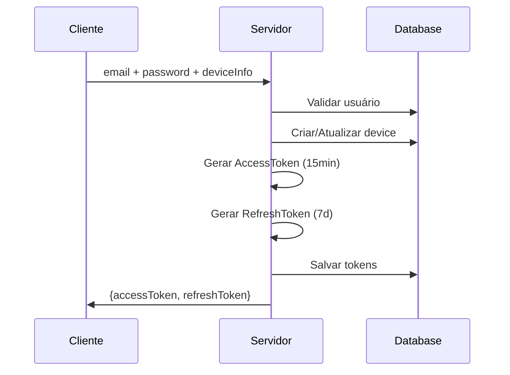
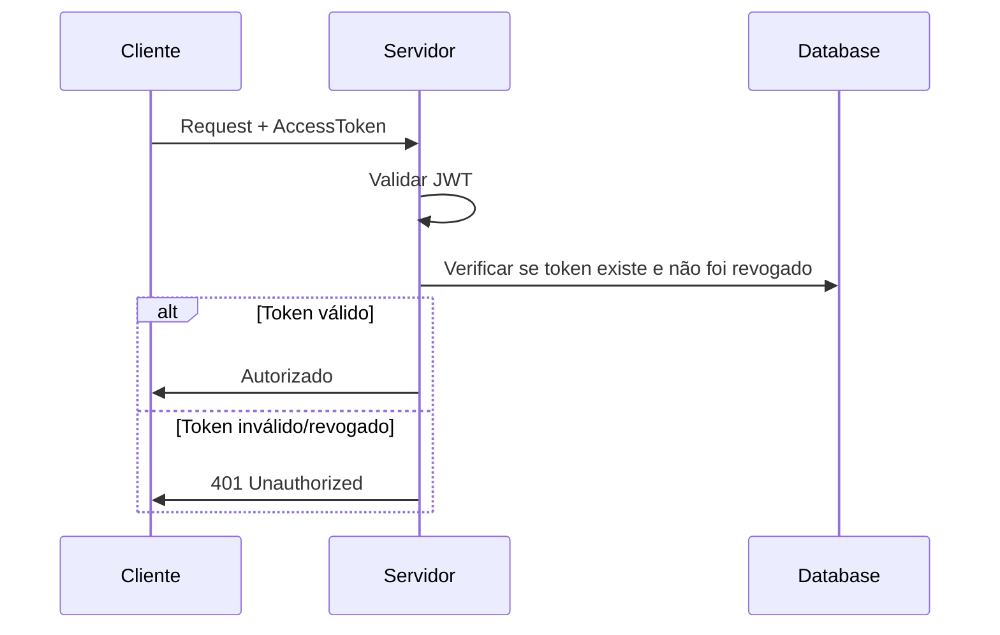
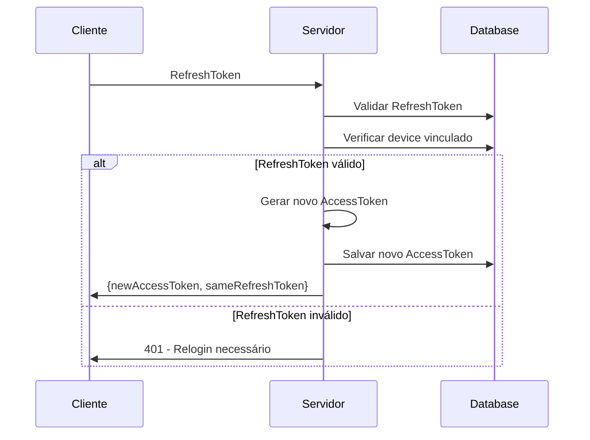
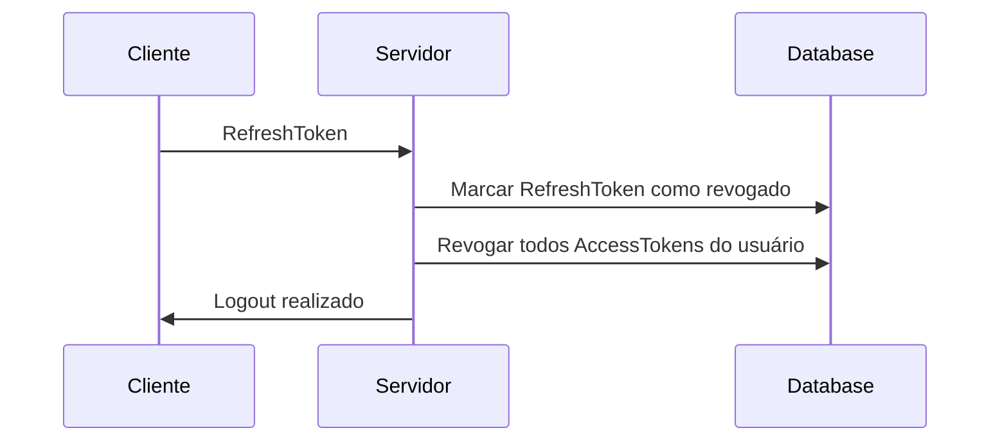

# Arquitetura de Autenticação - Access & Refresh Tokens

## Visão Geral

Este documento explica a arquitetura de autenticação implementada no sistema, baseada em **Access Tokens** e **Refresh Tokens** com vinculação a dispositivos específicos.

## Abordagem Padrão vs Nossa Implementação

### 🔄 Abordagem Padrão (JWT Stateless)

```
┌─────────────────┐    JWT Token     ┌─────────────────┐
│     Cliente     │ ────────────────► │    Servidor     │
│                 │                   │                 │
│ • Armazena JWT  │                   │ • Valida JWT    │
│ • Envia header  │                   │ • Verifica sig  │
└─────────────────┘                   └─────────────────┘
```

**Características:**
- ✅ Stateless (sem estado no servidor)
- ✅ Escalável horizontalmente
- ❌ Difícil revogação de tokens
- ❌ Sem controle granular de sessões
- ❌ Tokens de longa duração = risco de segurança

### 🛡️ Nossa Implementação (Hybrid + Device Binding)

```
┌─────────────────┐                   ┌─────────────────┐
│     Cliente     │                   │    Servidor     │
│                 │                   │                 │
│ • AccessToken   │ ────────────────► │ • Valida JWT    │
│   (15min)       │                   │ • Verifica DB   │
│                 │                   │ • Device bind   │
│ • RefreshToken  │ ────────────────► │ • Renovação     │
│   (7 dias)      │                   │ • Revogação     │
└─────────────────┘                   └─────────────────┘
```

## Entidades Principais

### 1. AccessToken
```typescript
interface AccessTokenProps {
  userId: UniqueEntityID;
  token: string;           // JWT de curta duração (15min)
  expiresAt: Date;         // Controle de expiração
  createdAt: Date;
  revoked: boolean;        // Revogação granular
}
```

**Características:**
- 🕐 **Curta duração**: 15 minutos
- 🔐 **Validação dupla**: JWT + verificação no banco
- ⚡ **Revogação imediata**: Campo `revoked`
- 📱 **Sem device binding**: Flexibilidade de uso

### 2. RefreshToken
```typescript
interface RefreshTokenProps {
  userId: UniqueEntityID;
  deviceId: UniqueEntityID;  // 🔗 Vinculação ao dispositivo
  token: string;             // JWT de longa duração (7 dias)
  expiresAt: Date;
  revokedAt?: Date;         // Timestamp de revogação
  revoked: boolean;         // Status de revogação
  createdAt: Date;
}
```

**Características:**
- ⏰ **Longa duração**: 7 dias
- 🔗 **Device binding**: Vinculado a dispositivo específico
- 🛡️ **Revogação controlada**: `revokedAt` + `revoked`
- 📊 **Auditoria**: Rastreamento completo de uso

### 3. Device
```typescript
interface DeviceProps {
  userId: UniqueEntityID;
  name: string;            // Nome do dispositivo
  type: string;            // mobile, desktop, tablet
  operatingSystem: string; // iOS, Android, Windows
  ipAddress: string;       // IP de origem
  browser: string;         // User agent
  location: string;        // Localização geográfica
  lastLogin: Date;
  active: boolean;
}
```

## Fluxo de Autenticação

### 1. Login (authenticate-device)


### 2. Validação de Requisição


### 3. Renovação de Token


### 4. Logout


## Vantagens da Nossa Abordagem

### 🛡️ Segurança
- **Tokens de curta duração**: Reduz janela de exposição
- **Revogação granular**: Controle total sobre sessões
- **Device binding**: Previne uso não autorizado
- **Auditoria completa**: Rastreamento de todos os acessos

### 📱 Controle de Dispositivos
- **Sessões por dispositivo**: Usuário pode ver todos dispositivos
- **Revogação seletiva**: Logout remoto de dispositivos específicos
- **Detecção de anomalias**: Novos dispositivos/localizações

### ⚡ Performance
- **Validação eficiente**: Cache + índices no banco
- **Escalabilidade**: Stateless com benefícios de stateful
- **Flexibilidade**: Políticas de expiração configuráveis

## Casos de Uso Principais

### 1. AuthenticateDeviceUseCase
- Valida credenciais do usuário
- Cria/atualiza informações do dispositivo
- Gera par de tokens (Access + Refresh)
- Atualiza último login do usuário

### 2. ValidateTokenUseCase
- Valida JWT do AccessToken
- Verifica existência e status no banco
- Retorna informações do usuário autenticado

### 3. RefreshAccessTokenUseCase
- Valida RefreshToken
- Verifica vinculação com dispositivo
- Gera novo AccessToken
- Mantém o RefreshToken ativo

### 4. LogoutUserUseCase
- Revoga RefreshToken específico
- Remove AccessTokens relacionados
- Atualiza status de revogação

## Considerações de Implementação

### Base de Dados
```sql
-- Índices otimizados para performance
CREATE INDEX idx_access_token_token ON access_tokens(token);
CREATE INDEX idx_access_token_user_id ON access_tokens(user_id);
CREATE INDEX idx_refresh_token_token ON refresh_tokens(token);
CREATE INDEX idx_refresh_token_device ON refresh_tokens(device_id);
```

### Cache Strategy
- Cache de AccessTokens válidos (Redis)
- Invalidação em revogação
- TTL alinhado com expiração do token

### Monitoramento
- Métricas de uso por dispositivo
- Alertas de múltiplos logins simultâneos
- Dashboard de sessões ativas

## Comparação Final

| Aspecto | Padrão JWT | Nossa Implementação |
|---------|------------|-------------------|
| **Segurança** | Moderada | Alta |
| **Controle** | Limitado | Granular |
| **Revogação** | Difícil | Imediata |
| **Auditoria** | Limitada | Completa |
| **Dispositivos** | Não suportado | Nativo |
| **Performance** | Alta | Alta* |
| **Complexidade** | Baixa | Moderada |

*Com cache adequado

## Conclusão

Nossa implementação oferece o melhor dos dois mundos: a eficiência de JWTs com o controle de sessões stateful, adicionando segurança através de device binding e controle granular de revogação.

Esta arquitetura é ideal para aplicações que precisam de:
- Alto nível de segurança
- Controle de dispositivos
- Auditoria completa
- Revogação imediata de acessos