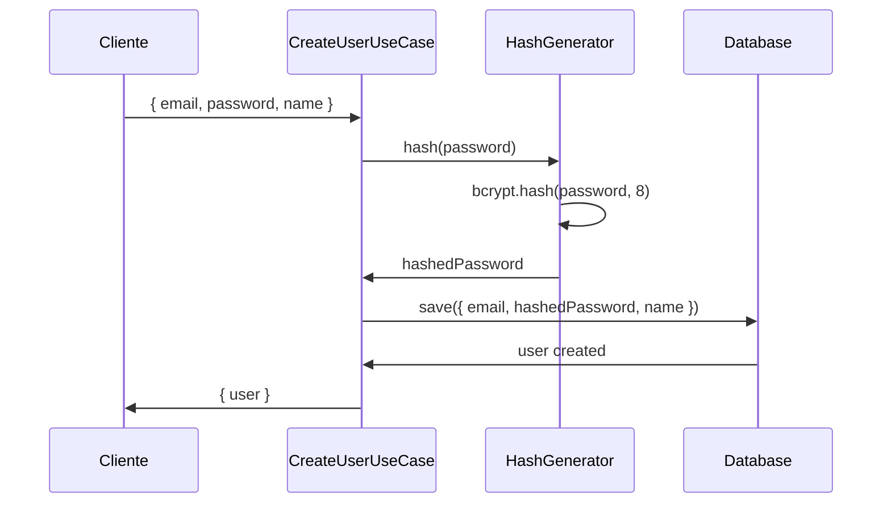
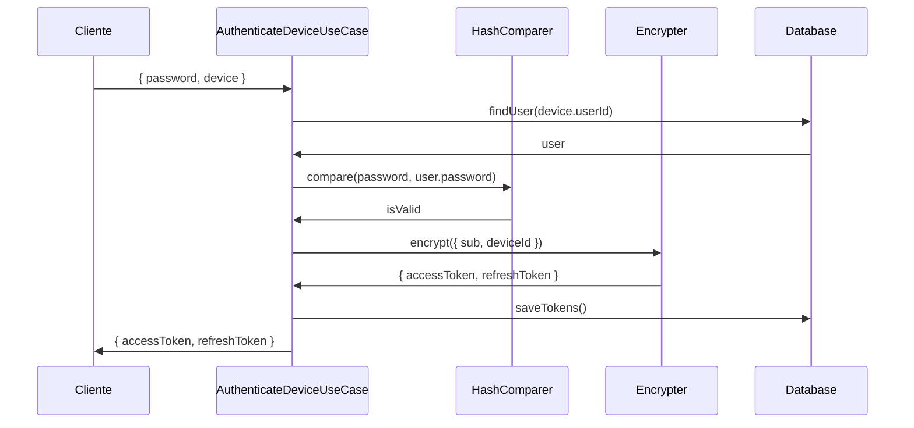
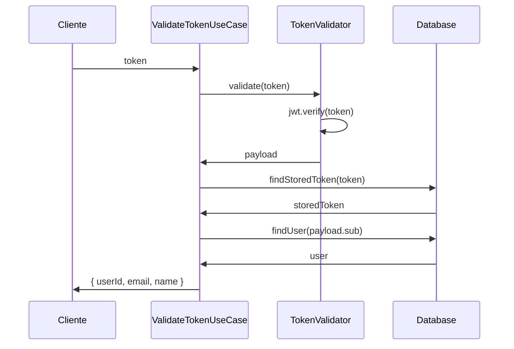

# Documentação Completa da Arquitetura de Criptografia - Auth-Min

## Índice
1. [Visão Geral da Arquitetura](#visão-geral-da-arquitetura)
2. [Camada Domain - Contratos e Interfaces](#camada-domain---contratos-e-interfaces)
3. [Camada Infrastructure - Implementações Concretas](#camada-infrastructure---implementações-concretas)
4. [Casos de Uso e Integração](#casos-de-uso-e-integração)
5. [Injeção de Dependência e Módulos](#injeção-de-dependência-e-módulos)
6. [Fluxos de Segurança Detalhados](#fluxos-de-segurança-detalhados)
7. [Análise Linha por Linha](#análise-linha-por-linha)

---

## Visão Geral da Arquitetura

O sistema de criptografia do Auth-Min segue os princípios da **Clean Architecture** e **Domain-Driven Design (DDD)**, separando claramente as responsabilidades entre:

- **Domain Layer**: Define contratos abstratos (interfaces) que representam as necessidades de negócio
- **Infrastructure Layer**: Implementa os contratos usando bibliotecas e tecnologias específicas
- **Application Layer**: Orquestra o uso das funcionalidades criptográficas nos casos de uso

### Principais Responsabilidades Criptográficas:

1. **Geração e Comparação de Hash** (Senhas de usuários)
2. **Criptografia de Tokens** (JWT para autenticação)
3. **Criptografia de Segredos** (AES para dados sensíveis)
4. **Validação de Tokens** (Verificação de JWT)

---

## Camada Domain - Contratos e Interfaces

### 1. HashGenerator (`src/domain/auth/application/cryptography/hash-generator.ts`)

**Propósito**: Define o contrato para geração de hash de senhas.

```typescript
export abstract class HashGenerator {
  abstract hash(plain: string): Promise<string>;
}
```

**Análise detalhada**:
- **Linha 1**: Declaração da classe abstrata que serve como contrato
- **Linha 2**: Método abstrato que recebe texto plano e retorna hash
- **Parâmetro `plain`**: String contendo a senha em texto plano
- **Retorno**: Promise que resolve para o hash da senha
- **Por que abstrata?**: Permite trocar implementações (bcrypt, argon2, etc.) sem afetar a lógica de negócio

### 2. HashComparer (`src/domain/auth/application/cryptography/hash-comparer.ts`)

**Propósito**: Define o contrato para comparação de senhas com seus hashes.

```typescript
export abstract class HashComparer {
  abstract compare(plain: string, hash: string): Promise<boolean>;
}
```

**Análise detalhada**:
- **Linha 1**: Classe abstrata para comparação de hashes
- **Linha 2**: Método que compara texto plano com hash existente
- **Parâmetro `plain`**: Senha fornecida pelo usuário
- **Parâmetro `hash`**: Hash armazenado no banco de dados
- **Retorno**: Boolean indicando se a senha está correta
- **Segurança**: Previne timing attacks através de comparação segura

### 3. Encrypter (`src/domain/auth/application/cryptography/encrypter.ts`)

**Propósito**: Define o contrato para geração de tokens de acesso e refresh.

```typescript
export abstract class Encrypter {
  abstract encrypt(payload: { sub: string; deviceId: string }): Promise<{
    accessToken: string;
    refreshToken: string;
  }>;
}
```

**Análise detalhada**:
- **Linha 1**: Classe abstrata para criptografia de tokens
- **Linha 2-5**: Método que recebe payload e retorna tokens
- **Payload `sub`**: Subject (ID do usuário)
- **Payload `deviceId`**: Identificador único do dispositivo
- **Retorno**: Objeto contendo access token (1h) e refresh token (7d)
- **Flexibilidade**: Permite diferentes implementações (JWT, JWE, etc.)

### 4. SecretEncrypter (`src/domain/auth/application/cryptography/secret-encrypter.ts`)

**Propósito**: Define o contrato para criptografia simétrica de dados sensíveis.

```typescript
export abstract class SecretEncrypter {
  abstract encrypt(plainText: string): Promise<string>;
  abstract decrypt(encryptedText: string): Promise<string>;
}
```

**Análise detalhada**:
- **Linha 1**: Classe abstrata para criptografia de segredos
- **Linha 2**: Método para criptografar texto plano
- **Linha 3**: Método para descriptografar texto cifrado
- **Uso comum**: Códigos 2FA, dados PII, chaves temporárias
- **Simetria**: Mesma chave para criptografar e descriptografar

### 5. TokenValidator (`src/domain/auth/application/cryptography/token-validator.ts`)

**Propósito**: Define o contrato para validação de tokens JWT.

```typescript
export interface TokenPayload {
  sub: string;
  email?: string;
  type?: string;
  deviceId?: string;
}

export abstract class TokenValidator {
  abstract validate(token: string): Promise<TokenPayload | null>;
}
```

**Análise detalhada**:
- **Linhas 1-6**: Interface definindo estrutura do payload do token
- **`sub`**: Subject obrigatório (ID do usuário)
- **`email`**: Email opcional para contexto adicional
- **`type`**: Tipo do token (access/refresh)
- **`deviceId`**: ID do dispositivo para controle de sessão
- **Linha 8-10**: Classe abstrata para validação
- **Retorno null**: Token inválido ou expirado

---

## Camada Infrastructure - Implementações Concretas

### 1. BcryptHasher (`src/infra/cryptography/bcrypt-hasher.ts`)

**Propósito**: Implementação de hash usando bcrypt para senhas.

```typescript
import { hash, compare } from 'bcryptjs'
import { HashComparer } from '@/domain/auth/application/cryptography/hash-comparer'
import { HashGenerator } from '@/domain/auth/application/cryptography/hash-generator'

export class BcryptHasher implements HashGenerator, HashComparer {
  private HASH_SALT_LENGTH = 8

  hash(plain: string): Promise<string> {
    return hash(plain, this.HASH_SALT_LENGTH)
  }

  compare(plain: string, hash: string): Promise<boolean> {
    return compare(plain, hash)
  }
}
```

**Análise linha por linha**:
- **Linha 1**: Importa funções do bcryptjs (biblioteca de hash segura)
- **Linha 2-3**: Importa contratos do domain
- **Linha 5**: Implementa ambas as interfaces (Single Responsibility)
- **Linha 6**: Salt length = 8 (2^8 = 256 rounds, balanço segurança/performance)
- **Linha 8-10**: Implementação do hash usando bcrypt com salt
- **Linha 12-14**: Implementação da comparação segura
- **Segurança**: bcrypt é resistente a ataques de força bruta e timing

### 2. JwtEncrypter (`src/infra/cryptography/jwt-encrypter.ts`)

**Propósito**: Implementação de criptografia de tokens usando JWT.

```typescript
import { Encrypter } from '@/domain/auth/application/cryptography/encrypter'
import { Injectable } from '@nestjs/common'
import { JwtService } from '@nestjs/jwt'

@Injectable()
export class JwtEncrypter implements Encrypter {
  constructor(private jwtService: JwtService) {}

  async encrypt(payload: Record<string, unknown>): Promise<{ accessToken: string; refreshToken: string }> {
    const accessTokenPayload = {
      ...payload,
      type: 'access'
    }

    const refreshTokenPayload = {
      ...payload,
      type: 'refresh'
    }

    const accessToken = await this.jwtService.signAsync(accessTokenPayload, {
      expiresIn: '1h'
    })

    const refreshToken = await this.jwtService.signAsync(refreshTokenPayload, {
      expiresIn: '7d'
    })

    return {
      accessToken,
      refreshToken
    }
  }
}
```

**Análise linha por linha**:
- **Linha 1-3**: Importações necessárias
- **Linha 5**: Decorator Injectable para DI do NestJS
- **Linha 7**: Injeta JwtService configurado
- **Linha 9**: Método implementando o contrato
- **Linha 10-13**: Cria payload para access token com type 'access'
- **Linha 15-18**: Cria payload para refresh token com type 'refresh'
- **Linha 20-22**: Gera access token com expiração de 1 hora
- **Linha 24-26**: Gera refresh token com expiração de 7 dias
- **Linha 28-31**: Retorna ambos os tokens
- **Segurança**: Tokens diferentes para diferentes propósitos

### 3. AesSecretEncrypter (`src/infra/cryptography/aes-secret-encrypter.ts`)

**Propósito**: Implementação de criptografia simétrica usando AES-256-CBC.

```typescript
import { Injectable } from '@nestjs/common'
import { createCipheriv, createDecipheriv, randomBytes, createHash } from 'crypto'
import { SecretEncrypter } from '@/domain/auth/application/cryptography/secret-encrypter'

@Injectable()
export class AesSecretEncrypter implements SecretEncrypter {
  private readonly algorithm = 'aes-256-cbc'
  private readonly secretKey: Buffer

  constructor() {
    const key = process.env.SECRET_ENCRYPTION_KEY || 'default-secret-key-for-2fa'
    this.secretKey = createHash('sha256').update(key).digest()
  }

  async encrypt(plainText: string): Promise<string> {
    const iv = randomBytes(16)
    const cipher = createCipheriv(this.algorithm, this.secretKey, iv)
    let encrypted = cipher.update(plainText, 'utf8', 'hex')
    encrypted += cipher.final('hex')
    return iv.toString('hex') + ':' + encrypted
  }

  async decrypt(encryptedText: string): Promise<string> {
    const [ivHex, encrypted] = encryptedText.split(':')
    const iv = Buffer.from(ivHex, 'hex')
    const decipher = createDecipheriv(this.algorithm, this.secretKey, iv)
    let decrypted = decipher.update(encrypted, 'hex', 'utf8')
    decrypted += decipher.final('utf8')
    return decrypted
  }
}
```

**Análise linha por linha**:
- **Linha 1-3**: Importações do NestJS e crypto nativo do Node.js
- **Linha 5**: Decorator Injectable
- **Linha 7**: Algoritmo AES-256-CBC (Advanced Encryption Standard)
- **Linha 8**: Chave secreta derivada do ambiente
- **Linha 10-13**: Constructor que gera chave a partir de variável de ambiente
- **Linha 12**: SHA-256 hash da chave para garantir 256 bits
- **Linha 15-21**: Método de criptografia
  - **Linha 16**: Gera IV (Initialization Vector) aleatório de 16 bytes
  - **Linha 17**: Cria cipher com algoritmo, chave e IV
  - **Linha 18-19**: Criptografa texto convertendo UTF-8 para hex
  - **Linha 20**: Retorna IV + texto cifrado separados por ':'
- **Linha 23-30**: Método de descriptografia
  - **Linha 24**: Separa IV do texto cifrado
  - **Linha 25**: Converte IV de hex para Buffer
  - **Linha 26**: Cria decipher
  - **Linha 27-28**: Descriptografa convertendo hex para UTF-8
- **Segurança**: IV único para cada operação previne ataques de replay

### 4. JwtTokenValidator (`src/infra/cryptography/jwt-token-validator.ts`)

**Propósito**: Implementação de validação de tokens JWT.

```typescript
import { Injectable } from '@nestjs/common'
import { JwtService } from '@nestjs/jwt'
import { TokenValidator, TokenPayload } from '@/domain/auth/application/cryptography/token-validator'

@Injectable()
export class JwtTokenValidator implements TokenValidator {
  constructor(private jwtService: JwtService) {}

  async validate(token: string): Promise<TokenPayload | null> {
    try {
      const decoded = await this.jwtService.verifyAsync(token)
      
      return {
        sub: decoded.sub,
        email: decoded.email,
        type: decoded.type,
        deviceId: decoded.deviceId
      }
    } catch (error) {
      return null
    }
  }
}
```

**Análise linha por linha**:
- **Linha 1-3**: Importações necessárias
- **Linha 5-7**: Classe injectable com JwtService injetado
- **Linha 9**: Método de validação que retorna payload ou null
- **Linha 10-18**: Try-catch para capturar tokens inválidos
- **Linha 11**: Verifica assinatura e expiração do token
- **Linha 13-17**: Extrai campos do payload decodificado
- **Linha 19-21**: Retorna null se token é inválido
- **Segurança**: Validação de assinatura e expiração automática

---

## Casos de Uso e Integração

### 1. CreateUserUseCase - Hash de Senhas

**Arquivo**: `src/domain/auth/application/use-cases/create-user.ts`

```typescript
// Linhas 24-26: Injeção de dependências
constructor(
  private userRepository: UsersRepository,
  private hashGenerator: HashGenerator  // Interface do domain
) {}

// Linha 40: Uso do hash generator
const hashedPassword = await this.hashGenerator.hash(password);

// Linhas 42-49: Criação do usuário com senha hasheada
const user = User.create({
  email,
  password: hashedPassword,  // Senha nunca armazenada em texto plano
  name,
}, new UniqueEntityID(email));
```

**Fluxo de Segurança**:
1. Usuário fornece senha em texto plano
2. HashGenerator (bcrypt) gera hash com salt
3. Apenas hash é armazenado no banco
4. Texto plano é descartado da memória

### 2. AuthenticateDeviceUseCase - Autenticação Completa

**Arquivo**: `src/domain/auth/application/use-cases/authenticate-device.ts`

```typescript
// Linhas 31-37: Injeção de todas as dependências criptográficas
constructor(
  private devicesRepository: DevicesRepository,
  private usersRepository: UsersRepository,
  private refreshTokenRepository: RefreshTokenRepository,
  private hashComparer: HashComparer,    // Para verificar senha
  private encrypter: Encrypter          // Para gerar tokens
) {}

// Linhas 48-51: Verificação da senha
const isPasswordValid = await this.hashComparer.compare(
  password,      // Senha fornecida pelo usuário
  user.password  // Hash armazenado no banco
);

// Linhas 63-66: Geração de tokens após autenticação
const { accessToken, refreshToken } = await this.encrypter.encrypt({
  sub: user.id.toString(),              // Subject (ID do usuário)
  deviceId: updatedDevice.id.toString(), // ID do dispositivo
});

// Linhas 68-74: Criação da entidade AccessToken
const accessTokenEntity = AccessToken.create({
  userId: new UniqueEntityID(user.id.toString()),
  token: accessToken,
  createdAt: new Date(),
  expiresAt: new Date(Date.now() + 1 * 24 * 60 * 60 * 1000), // 1 dia
  revoked: false,
});

// Linhas 76-83: Criação da entidade RefreshToken
const refreshTokenEntity = RefreshToken.create({
  userId: new UniqueEntityID(user.id.toString()),
  deviceId: updatedDevice.id,
  token: refreshToken,
  createdAt: new Date(),
  expiresAt: new Date(Date.now() + 7 * 24 * 60 * 60 * 1000), // 7 dias
  revoked: false,
});
```

**Fluxo Completo de Autenticação**:
1. **Verificação de Credenciais**: HashComparer verifica senha
2. **Geração de Tokens**: Encrypter cria access e refresh tokens
3. **Persistência**: Tokens são armazenados para controle de sessão
4. **Auditoria**: Device e User são atualizados com último login

### 3. ValidateTokenUseCase - Validação de Acesso

**Arquivo**: `src/domain/auth/application/use-cases/validate-token.ts`

```typescript
// Linhas 17-21: Injeção de dependências
constructor(
  private userRepository: UsersRepository,
  private accessTokenRepository: AccessTokenRepository,
  private tokenValidator: TokenValidator  // Para validar JWT
) {}

// Linha 26: Validação criptográfica do token
const payload = await this.tokenValidator.validate(token);

// Linhas 28-30: Verificação de tipo de token
if (!payload || payload.type === "refresh") {
  return left(new InvalidTokenError());
}

// Linhas 32-38: Verificação no banco de dados
const storedAccessToken = await this.accessTokenRepository.findByToken(token);
if (!storedAccessToken || storedAccessToken.isExpired()) {
  return left(new InvalidTokenError());
}

// Linhas 40-46: Verificação de usuário
const user = await this.userRepository.findById(new UniqueEntityID(payload.sub));
if (!user) {
  return left(new InvalidTokenError());
}
```

**Múltiplas Camadas de Validação**:
1. **Validação Criptográfica**: Assinatura e expiração do JWT
2. **Validação de Tipo**: Apenas access tokens são aceitos
3. **Validação de Persistência**: Token deve existir no banco
4. **Validação de Usuário**: Usuário deve existir e estar ativo

---

## Injeção de Dependência e Módulos

### CryptographyModule (`src/infra/cryptography/cryptography.module.ts`)

```typescript
import { Module } from '@nestjs/common'

// Importação dos contratos do domain
import { Encrypter } from '@/domain/auth/application/cryptography/encrypter'
import { HashComparer } from '@/domain/auth/application/cryptography/hash-comparer'
import { HashGenerator } from '@/domain/auth/application/cryptography/hash-generator'
import { SecretEncrypter } from '@/domain/auth/application/cryptography/secret-encrypter'
import { TokenValidator } from '@/domain/auth/application/cryptography/token-validator'

// Importação das implementações da infraestrutura
import { JwtEncrypter } from './jwt-encrypter'
import { BcryptHasher } from './bcrypt-hasher'
import { AesSecretEncrypter } from './aes-secret-encrypter'
import { JwtTokenValidator } from './jwt-token-validator'

@Module({
  providers: [
    // Mapeamento de contratos para implementações
    { provide: Encrypter, useClass: JwtEncrypter },
    { provide: HashComparer, useClass: BcryptHasher },
    { provide: HashGenerator, useClass: BcryptHasher },
    { provide: SecretEncrypter, useClass: AesSecretEncrypter },
    { provide: TokenValidator, useClass: JwtTokenValidator }
  ],
  exports: [Encrypter, HashComparer, HashGenerator, SecretEncrypter, TokenValidator]
})
export class CryptographyModule {}
```

**Análise da Arquitetura de DI**:

- **Linha 16-21**: Configuração de providers com mapeamento explícito
- **Inversão de Dependência**: Classes dependem de abstrações, não implementações
- **Flexibilidade**: Trocar bcrypt por argon2 requer apenas mudança neste módulo
- **Testabilidade**: Fácil mockar interfaces para testes unitários
- **Exportação**: Linha 22 torna os serviços disponíveis para outros módulos

**Benefícios da Arquitetura**:
1. **Baixo Acoplamento**: Use cases não conhecem implementações específicas
2. **Alta Coesão**: Cada implementação tem responsabilidade única
3. **Testabilidade**: Interfaces podem ser facilmente mockadas
4. **Manutenibilidade**: Mudanças em implementações não afetam lógica de negócio

---

## Fluxos de Segurança Detalhados

### 1. Fluxo de Registro de Usuário



### 2. Fluxo de Autenticação



### 3. Fluxo de Validação de Token



---

## Análise Linha por Linha

### Segurança do AesSecretEncrypter

**Linha por linha da função encrypt**:

```typescript
async encrypt(plainText: string): Promise<string> {
  // Linha 16: Gera IV único para cada operação
  const iv = randomBytes(16)
  
  // Linha 17: Cria cipher com parâmetros seguros
  const cipher = createCipheriv(this.algorithm, this.secretKey, iv)
  
  // Linha 18: Inicia criptografia convertendo UTF-8 para hex
  let encrypted = cipher.update(plainText, 'utf8', 'hex')
  
  // Linha 19: Finaliza criptografia e obtém padding
  encrypted += cipher.final('hex')
  
  // Linha 20: Combina IV e texto cifrado (IV:encrypted)
  return iv.toString('hex') + ':' + encrypted
}
```

**Elementos de Segurança**:
1. **IV Único**: Cada operação usa IV diferente (linha 16)
2. **AES-256-CBC**: Algoritmo robusto com chave de 256 bits
3. **Separação IV**: IV é incluído no resultado para descriptografia
4. **Formato Seguro**: IV em hex separado por ':' do texto cifrado

### Segurança do BcryptHasher

```typescript
hash(plain: string): Promise<string> {
  // Salt automático de 8 rounds (2^8 = 256 iterações)
  return hash(plain, this.HASH_SALT_LENGTH)
}

compare(plain: string, hash: string): Promise<boolean> {
  // Comparação segura que previne timing attacks
  return compare(plain, hash)
}
```

**Elementos de Segurança**:
1. **Salt Automático**: bcrypt gera salt único para cada hash
2. **Custo Configurável**: 8 rounds balanceia segurança e performance
3. **Timing Safe**: Comparação não vaza informações sobre diferenças
4. **Resistência**: Resistente a ataques rainbow table e força bruta

---

## Conclusão

A arquitetura de criptografia do Auth-Min demonstra:

1. **Separação de Responsabilidades**: Domain define "o que", Infrastructure define "como"
2. **Segurança por Design**: Múltiplas camadas de validação e algoritmos robustos
3. **Flexibilidade**: Fácil troca de implementações sem afetar lógica de negócio
4. **Testabilidade**: Interfaces abstratas facilitam testes unitários
5. **Manutenibilidade**: Código bem estruturado e documentado

### Pontos Fortes:
- Uso de algoritmos seguros (AES-256, bcrypt, JWT)
- IVs únicos e salts automáticos
- Validação em múltiplas camadas
- Arquitetura desacoplada

### Recomendações:
- Considerar rotação de chaves periodicamente
- Implementar rate limiting para tentativas de autenticação
- Adicionar logs de auditoria para operações criptográficas
- Considerar upgrade para algoritmos mais modernos (Argon2, ChaCha20)

Esta documentação fornece uma visão completa de como a criptografia é implementada e utilizada em todo o sistema, servindo como referência para desenvolvedores e auditores de segurança.